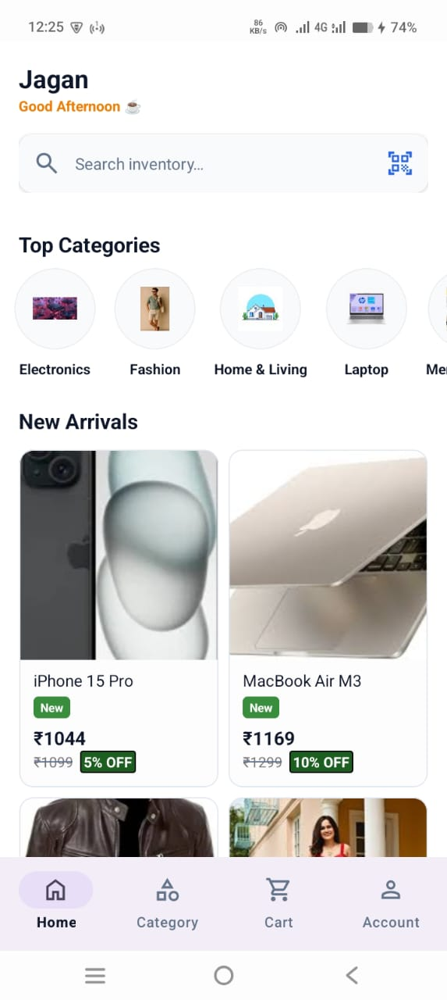
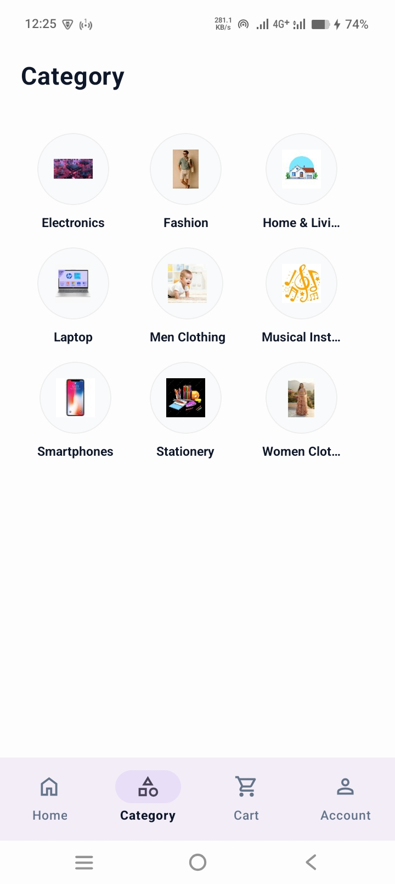
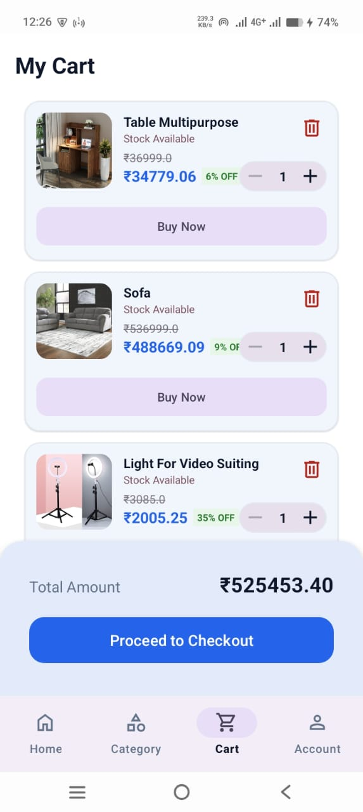
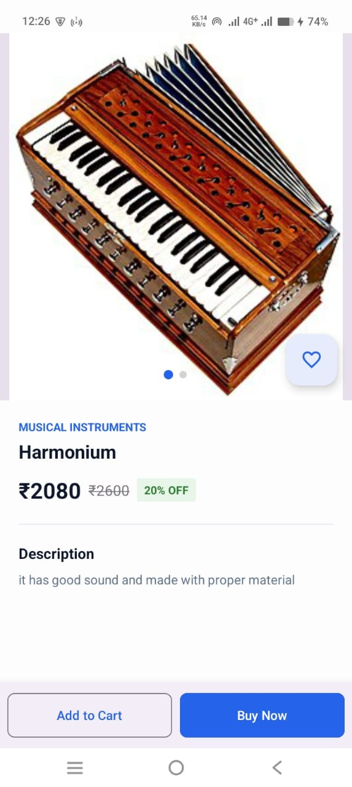
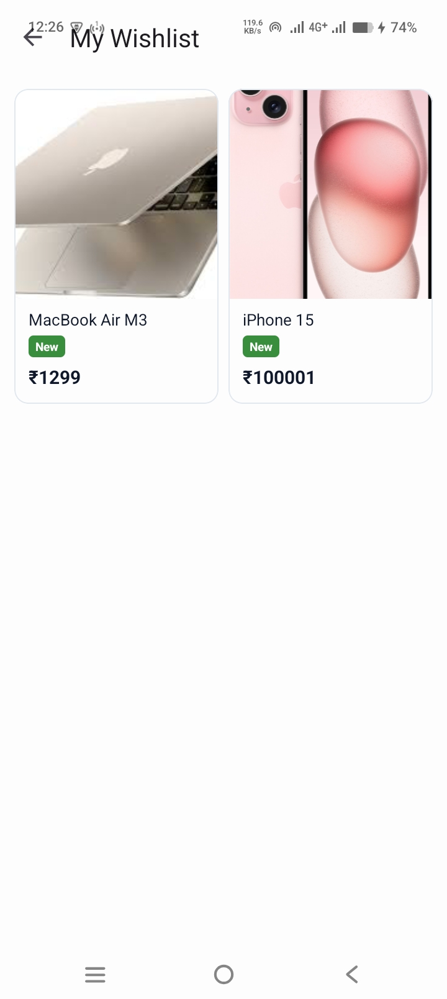

# 🛍️ VaruShop - E-Commerce Customer App

## 🚀 Overview
**VaruShop** is a dynamic, multi-vendor e-commerce application designed to provide users with a seamless shopping experience. Customers can browse categorized products, search for specific items, maintain a wishlist, and purchase from multiple different vendors simultaneously in a single checkout process. 

## ✨ Key Features

### 🛒 Shopping & Discovery
* **Lightning-Fast Search:** Integrated with **Meilisearch** to provide highly relevant, typo-tolerant, and blazing-fast product search results.
* **Category-Wise Browsing:** Navigate through cleanly organized categories to discover new items easily.
* **Personalized Wishlist:** Save favorite products to a wishlist for quick access and future purchases.

### ⭐ Ratings & Reviews
* **Advanced User Reviews:** Customers can leave ratings and detailed feedback on purchased items to help other users make informed decisions.

### 📦 Multi-Vendor Checkout & Tracking
* **Universal Cart:** Add products from the *same vendor* or *multiple different vendors* to a single cart and check out seamlessly at the same time.
* **Live Order Tracking:** Keep track of active orders from the moment they are placed until they are delivered to the doorstep.

### 🎁 Loyalty & Rewards
* **Reward Points System:** Earn loyalty points on every successfully placed order to encourage repeat shopping.

## 🗺️ Roadmap (Coming in Next Version)
VaruShop is continuously evolving. The following features are actively in development for the next major update:
* **Reward Point Redemption:** Users will be able to apply their earned reward points during checkout to get direct discounts on product prices.
* **Coupon & Promo System:** Integration of a coupon code system allowing users to apply special promotional discounts to their cart.

## 🛠 Tech Stack
* **Platform:** Android Studio
* **Language:** Kotlin
* **Backend/Database:** Node.js 
* **Search Engine:** Meilisearch
* **Architecture:**  MVVM

## 🎥 Video Demonstration
Watch the full working demo of the VaruShop app, including the multi-vendor cart and order tracking in action:

[](https://youtube.com/shorts/w4dK4qPv848?si=2mYQZwh411UmPJx7)


## 📸 Screenshots

<table>
  <tr>
    <td align="center"><a href="#"></a><br>Home Page</td>
    <td align="center"><a href="#"></a><br>Category Section</td>
    <td align="center"><a href="#"></a><br>Cart Section</td>
  </tr>
  <tr>
    <td align="center"><a href="#"></a><br>Order Details</td>
    <td align="center"><a href="#"></a><br>Active Orders</td>
    <td align="center"><a href="#"></a><br>Wishlist</td>
  </tr>
</table>

## 💻 Installation and Setup

1. **Clone the repository:**
```bash
   git clone this Repository

```

2. **Open the project:**
* Launch **Android Studio**.
* Select `File > Open` and choose the cloned project folder.


3. **Sync Dependencies:**
* Allow Android Studio to automatically sync the Gradle files and download required libraries.


4. **Run the app:**
* Connect a physical Android device or start an emulator.
* Click the green **Run** button or press `Shift + F10`.


1. **Clone the repository:**
```bash
   git clone [Your Repository URL]
